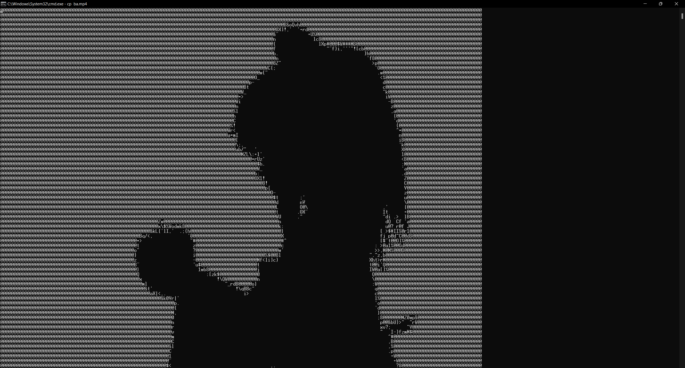
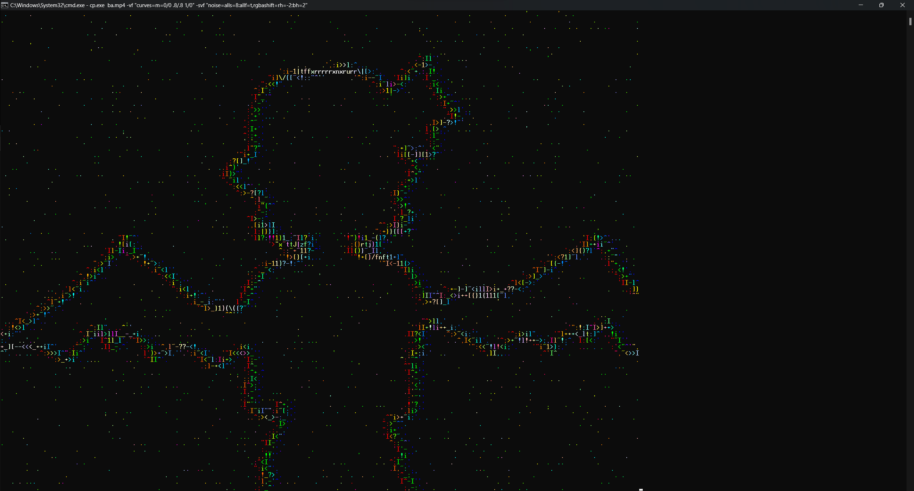
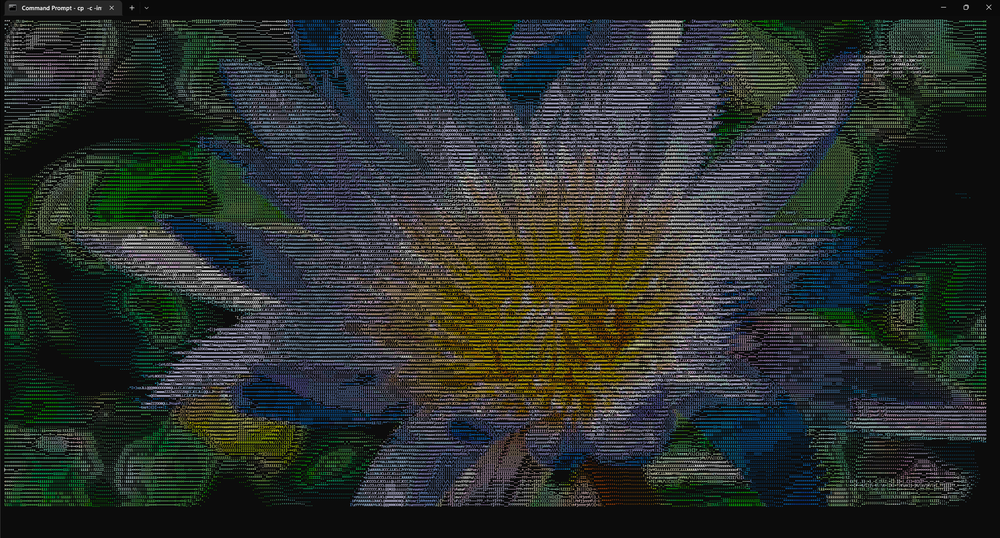

# ConPlayer
Allows you to play videos in console.

Inspired by [mariiaan/CmdPlay](https://github.com/mariiaan/CmdPlay) with significant improvements:
- plays videos in color
- uses libav instead of ffmpeg executable to read video and converts it on the fly, so it loads instantly
- allows you to resize console while playing video and it keeps its correct aspect ratio
- you can go back and skip forward video
- it has multiple advanced options like enabling interlacing, changing charset or applying FFmpeg filters

[Download Version 1.3](https://github.com/mt1006/ConPlayer/releases/tag/ConPlayer-1.3)

Demonstration: https://www.youtube.com/watch?v=nbUKhalJATk

# Examples

### "Bad Apple!!" in cmd



### Also "Bad Apple!!" in cmd but with FFmpeg filters

```conpl ba.mp4 -vf "curves=m=0/0 .8/.8 1/0" -svf "noise=alls=8:allf=t,rgbashift=rh=-2:bh=2"```



### Some random 4K test video with colors in Windows Terminal (https://www.youtube.com/watch?v=xcJtL7QggTI&t=96)



# Options

## Basic options
```
 [none] / -i         Just input file - audio or video.
                     Examples:
                      conpl video.mp4
 -c [mode]           Sets color mode. By default "cstd-256".
  (--colors)         To get list of all avaible color modes use "conpl -h color-modes".
                     Examples:
                      conpl video.mp4 -c winapi-16
 -vol [volume]       Sets audio volume. By default "0.5".
  (--volume)         Examples:
                      conpl video.mp4 -vol 0.2
 -s [w] [h]          Sets width and height of the drawn image.
  (--size)           By default size of entire window.
                     Using "-s 0 0" image size will be constant.
                     (will not change with the console size change).
                     Examples:
                      conpl video.mp4 -s 120 50
 -f  (--fill)        Fills entire available area, without keeping ratio.
 -inf(--information) Information about ConPlayer.
 -v  (--version)     Information about ConPlayer version.
 -h <topic>          Displays help message.
  (--help)           Topics: basic, advanced, color-modes, scaling-modes, keyboard, full
 ```

## Advanced options
```
 -int [divisor]      Uses interlacing to draw frames.
      <height>       The larger the divisor, fewer scanlines there are per frame.
  (--interlaced)     Height is optional parameter and means scanline height - by default 1.
                     When divisor is equal to 1, then interlacing is disabled.
                     Note: in winapi mode instead of improve performance, it may reduce it.
                     Examples:
                      conpl video.mp4 -int 2
                      conpl video.mp4 -int 4 3
 -sc [value]         Sets constant color in grayscale mode.
  (--set-color)      Only number - sets text attribute using WinAPI.
                     "@color" - sets color from ANSI 256 palette (only with cstd-gray).
                     "#RRGGBB" - sets RGB color (only with cstd-gray).
                     With "@" or "#" you can give second argument as background color.
                     Examples:
                      conpl video.mp4 -c winapi-gray -sc 4
                      conpl video.mp4 -c cstd-gray -sc @93
                      conpl video.mp4 -c cstd-gray -sc #FF00FF
                      conpl video.mp4 -c cstd-gray -sc #FF00FF FF0000
 -cs [charset]       Sets character set used for drawing frames.
  (--charset)        Takes name of file with charset or name of predefined charset.
                     Predefined charsets: #long, #short, #2, #blocks, #outline, #bold-outline.
                     Default charset is "#long".
                     Examples:
                      conpl video.mp4 -ch #blocks
                      conpl video.mp4 -ch my_charset.txt
 -sch                Uses single character to draw image and sets it's color to original
  (--single-char)    instead of recalculated. Requires colors!
                     Examples:
                      conpl video.mp4 -c cstd-rgb -sch
 -r [val]            Randomly increases or decreases pixel brightness by a random value
  (--rand)           between 0 and val/2. When "single char" mode is enabled or "@" sign
                     is placed before the number, brightness is decreased by a random value
                     between 0 and val.
                     Examples:
                      conpl video.mp4 -r 20
                      conpl video.mp4 -r @40
                      conpl video.mp4 -c cstd-rgb -sch -r 56
 -sm [mode]          Sets scaling mode. Default scaling mode is "bicubic".
  (--scaling-mode)   To get list of all avaible scaling modes use "conpl -h scaling-modes".
                     Examples:
                      conpl video.mp4 -sm nearest
 -fr [ratio]         Sets constant font ratio (x/y).
  (--font-ratio)     On Windows by default font ratio is obtained using WinAPI.
                     On Linux or if it's not posible, it's set to 8/18 (about 0.44).
                     Examples:
                      conpl video.mp4 -ft 0.5
 -sy [mode]          Sets synchronization mode.
  (--sync)           Available modes:
                     "disabled" - prints the output as fast as possible.
                     "draw-all" - synchronization enabled, but tries to draw all frames.
                     "enabled" - synchronization enabled, skips frames if necessary [default].
                     Examples:
                      conpl video.mp4 -sy draw-all
 -vf [filter]        Applies FFmpeg filters to the video.
  (--video-filters)  FFmpeg filters documentation: https://www.ffmpeg.org/ffmpeg-filters.html
                     Examples:
                      conpl video.mp4 -vf "colorchannelmixer=gg=0:bb=0"
                      conpl video.mp4 -vf "split[a][t];[t]crop=iw:ih/2:0:0,vflip[b];[a][b]overlay=0:H/2"
 -svf [filter]       Applies FFmpeg filters to the video after scaling.
  (--scaled-video-   Examples:
     filters)         conpl video.mp4 -svf "rgbashift=rh=-2:bh=2"
                      conpl video.mp4 -svf "noise=alls=8:allf=t"
 -af [filter]        Applies FFmpeg filters to the audio.
  (--audio-filters)  Examples:
                      conpl video.mp4 -af "aecho=0.8:0.88:60:0.4"
                      conpl video.mp4 -af "volume=80.0"
 -dcls               Disables clearing screen every new frame.
   (--disable-cls)   Uses new line instead. Useful for printing output to file.
                     Works properly only in "cstd" color mode and it breaks interlacing.
                     Examples:
                      conpl video.mp4 -c cstd-gray -s 80 30 -fr 0.5 -sy disabled -dcls > output.txt
 -da(--disable-audio)Disables audio.
 -dk (--disable-keys)Disables keyboard control.
 -avl (--libav-logs) Enables printing Libav logs. Helpful with FFmpeg filters problems.
 -fi (--full-info)   Full info about ConPlayer.
```

## Color modes
```
 >winapi-gray [Windows-only]
 >winapi-16 [Windows-only]
 >cstd-gray
 >cstd-16
 >cstd-256 [default]
 >cstd-rgb
```

## Scaling modes
```
 >nearest
 >fast-bilinear
 >bilinear
 >bicubic [default]
```

## Keyboard control
```
 Space      Pause/Play
 "[" / "]"  Go back / Skip forward (10 second)
 "-" / "+"  Go back / Skip forward (30 second)
 "L" / "O"  Turn down/up the volume
 "M"        Mute the audio
 ESC        Exit
```

# Compiling

## Windows

To compile ConPlayer on Windows you need Visual Studio. First, install vcpkg and integrate it with Visual Studio. Here is how to do it: https://vcpkg.io/en/getting-started.html. Then you need to install libav (FFmpeg's library) and libao.
```
vcpkg install ffmpeg[gpl,freetype,fontconfig,fribidi,ass,opencl,dav1d]:x64-windows
vcpkg install libao:x64-windows
```
Now you can just open .sln file and everything should work (at least in theory).\

## Linux

To compile ConPlayer on Linux you first need to have GCC. You also need ffmpeg (libav) and libao libraries. If you're using apt package manager, you can install them with these commands:
```
sudo apt-get install libavcodec-dev
sudo apt-get install libavformat-dev
sudo apt-get install libswscale-dev
sudo apt-get install libao-dev
```
Then you can just use ```make```.